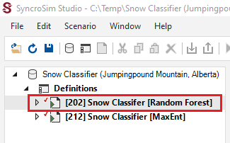
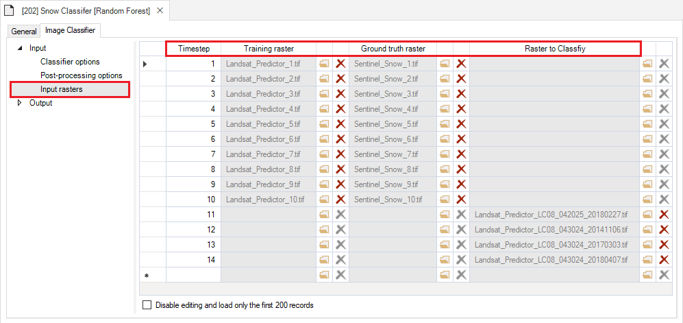
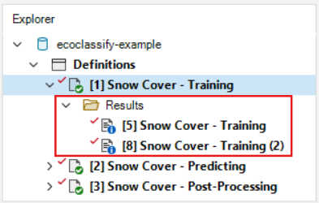
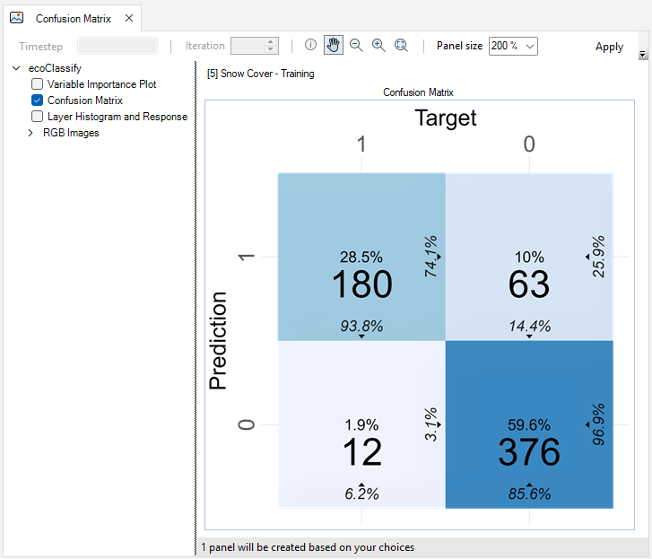
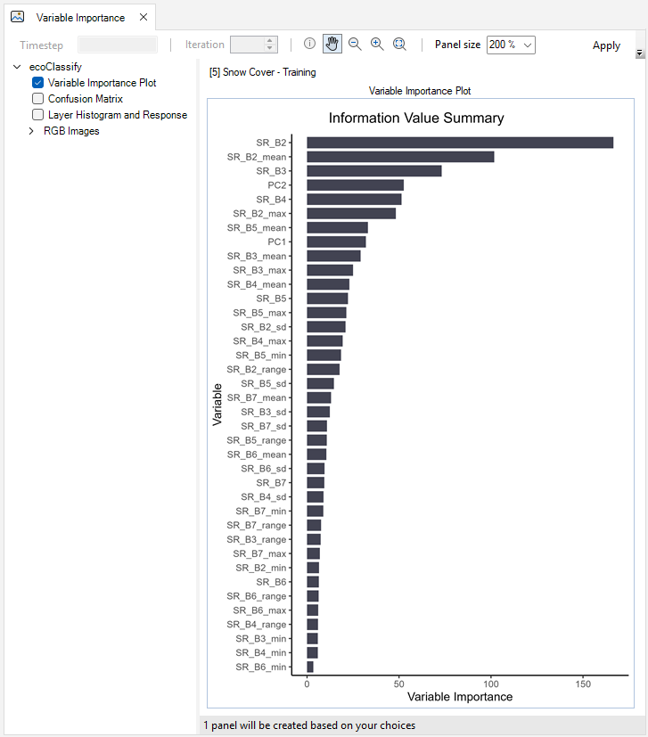

# Getting started with **ecoClassify**

### Here we provide a guided tutorial on **ecoClassify**, an open-source package for developing and applying an image classifier model.

**ecoClassify** is a package for SyncroSim, yet familiarity with SyncroSim is not required to get started with **ecoClassify**. Throughout the Quickstart tutorial, terminology associated with SyncroSim is italicized, and whenever possible, links are provided to the SyncroSim online documentation. For more on SyncroSim, please refer to the SyncroSim [Overview](https://docs.syncrosim.com/getting_started/overview.html){:target="_blank"} and [Quickstart tutorial](https://docs.syncrosim.com/getting_started/quickstart.html){:target="_blank"}.

 

## **ecoClassify** Quickstart Tutorial

This quickstart tutorial will introduce you to the basics of working with **ecoClassify**. The steps include:

1. <a href="#step1">Installing **ecoClassify**</a>
2. <a href="#step2">Opening a configured **ecoClassify** library</a>
3. <a href="#step3">Viewing model inputs</a> 
4. <a href="#step4">Running models</a>
5. <a href="#step5">Viewing model outputs and results</a>

 

 <h2>Step 1: Installing <b>ecoClassify</b></h2> 

**EcoClassify** is a package within the SyncroSim modeling framework and requires SyncroSim Studio to be installed on your computer. Download the latest stable release of SyncroSim Studio <a href="https://syncrosim.com/studio-download/" target="_blank">here</a> and follow the installation prompts.

Open SyncroSim Studio and select **File > Local Packages**. This will open the Local Packages window in the main panel of SyncroSim Studio. In the bottom left corner, click on **Install from Server…**, select **ecoClassify** from the window that opens, and click **OK**. 

If you do not have **Miniconda** installed on your computer, a dialog box will open asking if you would like to install Miniconda. Click **Yes**. Once Miniconda is done installing, a dialog box will open asking if you would like to create a new conda environment. Click **Yes**. Note that the process of installing Miniconda and the **ecoClassify** conda environment can take several minutes. If you choose not to install the conda environment you will need to manually install all required package dependencies.

> **Miniconda** is an installer for conda, a package environment manager that installs any required packages and their dependencies. By default, **ecoClassify** runs conda to install, create, save, and load the required environment for running **ecoClassify**. The **ecoClassify** environment includes <a href="https://www.r-project.org/" target="_blank">**R**</a> and <a href="https://www.python.org/" target="_blank">**Python**</a> software and associated packages.

 

 <h2>Step 2: Opening a configured <b>ecoClassify</b> library</h2> 

Having installed the **ecoClassify** *package*, you are now ready to create your SyncroSim *library*. A *library* is a file (with extension *.ssim*) that contains all your model inputs and outputs. Note that the layout of each *library* is specific to the *package* for which it was initially created. You can opt to create an empty *library* or download the ecoClassify template library in **SyncroSim Studio**. In this tutorial, we will be working with the ecoClassify template library.

Start SyncroSim Studio by searching for it using the Windows toolbar and under the file menu, select Open. Once SyncroSim Studio opens, navigate to **File > New** and select **From Online Template…**.  

 

Select the ecoClassify package. Browse for the `C:\Temp\` folder as the destination and click "**OK**.

 

The ecoClassify example library was created with **SyncroSim Studio v3.1.20**. If you have a more recent release of SyncroSim Studio installed, you will automatically be prompted to update the library to configure it to your installed version of the software. Click **Apply**. 

 

 <h2>Step 3: Viewing model inputs</h2> 

The contents of your newly opened library are now displayed in the **Library Explorer**. The *library* stores information on three levels: the *library*, the *project*, and the *scenarios*. 

Most model inputs in SyncroSim Studio are organized into *scenarios*, where each *scenario* consists of a suite of *properties*, one for each of the model’s required inputs. Because you downloaded and opened a complete **ecoClassify** library, your library already contains two demonstration *scenarios* with pre-configured model inputs and outputs. For the purpose of this tutorial' we'll focus on the **Snow Classifer [Random Forest]** *scenario*.

 

To view the details of the *scenario*:

* Select the scenario named **Snow Classifer [Random Forest]** in the **Library Explorer**.
* Right-click and choose **Open** from the context menu, and double-click on the scenario.

This opens the *scenario properties* window.

 

### Pipeline

Located underneath the **General** tab, the model **Pipeline** allows you to select which stages of the model to include and in what order they should be run. A full run of **ecoClassify** consists of two stages:

* (1) **Train Classifier**: training and ground-truthed rasters are used to create the classifier
* (2) **Forecast**: the classifier created is applied to rasters to classify

Note that the *Forecast* stage is dependent on the results of the previous stage, *Train Classifier*. You cannot run a stage without having first run the previous required stages.

 

Next, click on the **Datafeeds** node. Here, all of the inputs to the model are listed as individual datasheets. Notice how some rows have a green checkmark in the **Data** column to indicate these datasheets contain data. From here, you can navigate to these individual datasheets by clicking on their name in the **View** column, or by navigating to the next tab called **Image Classifier**.

 

### Input

The first node under the **Image Classifier** tab is the **Input** node. Expand this node to reveal the following input datasheets:

* **Classifier options**
* **Post-processing options**
* **Input rasters**

The **Classifier options** datasheet is where you may specify a sample size, choose whether you would like to apply contextualization or not, and choose from a drop-down menu of model types. Model types currently available include Random Forest and MaxEnt.In this example scenario, we use a Random Forest model. 

 

**Post-processing options** is where you can choose to apply filtering or not. If you choose to apply filtering, you may also apply a filter resolution and threshold.

 

Finally, the **Input rasters** datasheet is where all spatial data are loaded into the library. This includes training and ground-thruth rasters for creating the classifier, as well as the rasters that you would like to apply the classifier to. Note that this datasheet also contains a **Timestep** column. In the **ecoClassify** package, timesteps are used to link training rasters with their corresponding ground truth raster, and to distinguish these rasters from those that will be classified. 

 

 <h2>Step 4: Running models</h2> 

Right-click on the **Snow Classifer [Random Forest]** in the **Library Explorer** window and select **Run** from the context menu. If prompted to save your project, click **Yes**. The example model run should complete within a couple of minutes. If the run is successful, you will see a Status of **Done** in the **Run Monitor** window. If the run fails, you can click on the **Run Log** link to see a report of any problems that occurred.

 

 <h2>Step 5: Viewing model outputs and results</h2> 

Once the run is complete, you can view the details of the *result scenario*:

* In the **Library Explorer**, expand the drop-down arrow next to the **Snow Classifer [Random Forest]** *scenario* to reveal the *Results* folder. Nested under this folder are the *result scenarios*. Note that this template **ecoClassify** library already contains results, which is why there are two *result scenarios* associated with this *parent scenario*. 

 

* Right-click and choose **Open** from the context menu to view the details of the *result scenario* you just produced. This opens the *result scenario properties* window. The format of the *result scenario properties* is similar to the *scenario properties* but contains read-only datasheets with updated information produced during the model run. Notice how the output **Statistics** datasheet now appears in the *results scenario's* **Datafeeds**.  

 

You can look through the *result scenario* to see the updated or newly populated datasheets. You should find that the **Output** datasheet, **Statistics**, has been populated with model run outputs.

 

### Model Outputs

To view spatial outputs, move to the results panel at the bottom left of the **Library Explorer** window. Under the **Maps** tab, double-click on the **Predicted Presence [Classified]** map to visualize the classified rasters.

 

The first two columns show the **Unfiltered** and **Filtered** classified rasters compared to the **Probability** maps of snow presence.

 

Next, double-click on the **Predicted Presence [Training]** map to view the **Unfiltered** and **Filtered** results of the training rasters compared to the **Probability** and **Ground Truth** maps of snow presence and absence. 

 

**ecoClassify** also allows you to visual the RGB images of your classified and training rasters under the **Images** tab. 

 

Here, you may also view a confusion matrix quantifying the classifier's performance and a bar chart of the classifier's variable importance. In this Random Forest example, we can see that the SR_B2 variable was the most important variable in training the model.

 

## Export Data

To export a map or model output created by the **ecoClassify** package, add the *result scenario* with the desired outputs to the results and open the **Export** tab at the bottom of the screen. All available files for export will be listed. To export, simply double-click on the desired output and choose the directory in which to save the file in the pop-up window. Note that if multiple *result scenarios* are included in the active *result scenarios*, files for each of the selected scenarios will be exported. 

