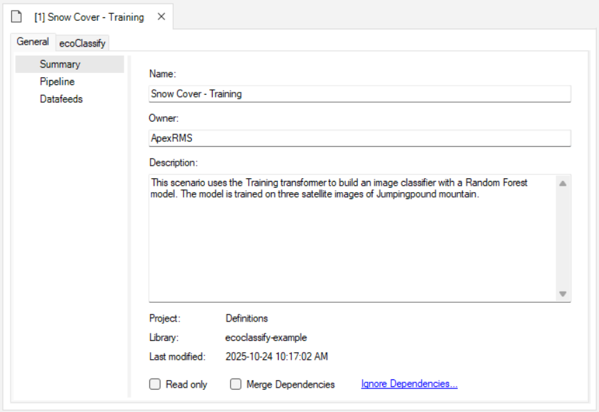
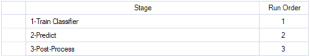
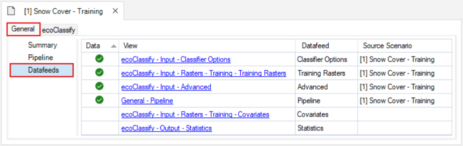
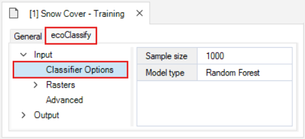
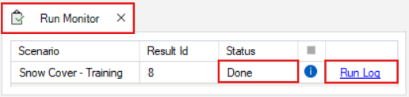
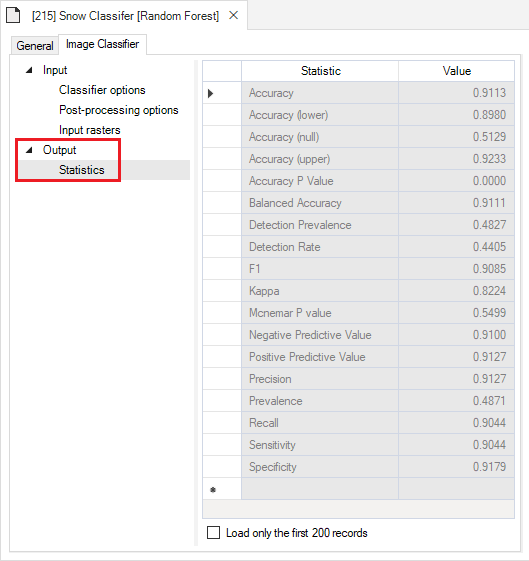
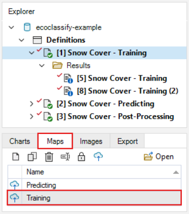

# Getting started with **ecoClassify**

### Here we provide a guided tutorial on **ecoClassify**, an open-source package for developing and applying an image classifier model.

**ecoClassify** is a package for SyncroSim, yet familiarity with SyncroSim is not required to get started with **ecoClassify**. Throughout the Quickstart tutorial, terminology associated with SyncroSim is italicized, and whenever possible, links are provided to the SyncroSim online documentation. For more on SyncroSim, please refer to the SyncroSim [Overview](https://docs.syncrosim.com/getting_started/overview.html){:target="_blank"} and [Quickstart tutorial](https://docs.syncrosim.com/getting_started/quickstart.html){:target="_blank"}.

 

## **ecoClassify** Quickstart Tutorial

This quickstart tutorial will introduce you to the basics of working with **ecoClassify**. The steps include:

1. <a href="#step1">Installing **ecoClassify**</a>
2. <a href="#step2">Opening a configured **ecoClassify** library</a>
3. <a href="#step3">Viewing model inputs</a> 
4. <a href="#step4">Running models</a>
5. <a href="#step5">Viewing model outputs and results</a>

 

 <h2>Step 1: Installing <b>ecoClassify</b></h2> 

**EcoClassify** is a package within the SyncroSim modeling framework and requires SyncroSim Studio to be installed on your computer. Download the latest stable release of SyncroSim Studio <a href="https://syncrosim.com/studio-download/" target="_blank">here</a> and follow the installation prompts.

Open SyncroSim Studio and select **File > Local Packages**. This will open the Local Packages window in the main panel of SyncroSim Studio. In the bottom left corner, click on **Install from Server…**, select **ecoClassify** from the window that opens, and click **OK**. 

If you do not have **Miniconda** installed on your computer, a dialog box will open asking if you would like to install Miniconda. Click **Yes**. Once Miniconda is done installing, a dialog box will open asking if you would like to create a new conda environment. Click **Yes**. Note that the process of installing Miniconda and the **ecoClassify** conda environment can take several minutes. If you choose not to install the conda environment you will need to manually install all required package dependencies.

> **Miniconda** is an installer for conda, a package environment manager that installs any required packages and their dependencies. By default, **ecoClassify** runs conda to install, create, save, and load the required environment for running **ecoClassify**. The **ecoClassify** environment includes <a href="https://www.r-project.org/" target="_blank">**R**</a> and <a href="https://www.python.org/" target="_blank">**Python**</a> software and associated packages.

 

 <h2>Step 2: Opening a configured <b>ecoClassify</b> library</h2> 

Having installed the **ecoClassify** *package*, you are now ready to create your SyncroSim *library*. A *library* is a file (with extension *.ssim*) that contains all your model inputs and outputs. Note that the layout of each *library* is specific to the *package* for which it was initially created. You can opt to create an empty *library* or download the ecoClassify template library in **SyncroSim Studio**. In this tutorial, we will be working with the ecoClassify template library.

Start SyncroSim Studio by searching for it using the Windows toolbar and under the file menu, select Open. Once SyncroSim Studio opens, navigate to **File > New** and select **From Online Template…**.  

 

Select the ecoClassify (version 2.3.0) package. Notice that the only available template is the ecoClassify Example. Select `C:\Temp\` as the destination folder and click **OK**. The ecoClassify example will automatically open in the **SyncroSim Studio** explorer.

 

The ecoClassify example library was created with **SyncroSim Studio v3.1.20**. If you have a more recent release of SyncroSim Studio installed, you will automatically be prompted to update the library to configure it to your installed version of the software. Click **Apply**. 

 

 <h2>Step 3: Viewing model inputs</h2> 

The contents of your newly opened library are now displayed in the **Library Explorer**. The *library* stores information on three levels: the *library*, the *project*, and the *scenarios*. 

Most model inputs in SyncroSim Studio are organized into *scenarios*, where each *scenario* consists of a suite of *properties*, one for each of the model’s required inputs. Because you downloaded and opened a complete **ecoClassify** library, your library already contains three demonstration *scenarios* with pre-configured model inputs and outputs. In this tutorial' we'll work through the **Snow Cover - Training**, **Snow Cover - Predicting**, and **Snow Cover - Post-Processing** *scenarios*, demonstrating each of the three steps in the ecoClassify pipeline.

 

To view the details of the *scenario*:

* Select the scenario named **Snow Cover - Training** in the **Library Explorer**.
* Right-click and choose **Open** from the context menu, or double-click on the scenario.

This opens the *scenario properties* window.

 

### Pipeline

Located underneath the **General** tab, the model **Pipeline** allows you to select which stages of the model to include and in what order they should be run. A full run of **ecoClassify** consists of three stages:

* (1) **Train Classifier**: training and ground-truthed rasters are used to create the classifier model
* (2) **Predict**: the classifier model is applied to "prediction" raster (i.e., rasters to be classified)
* (3) **Post-Process**: the output classification rasters are filtered, filled in, or reclassified based on a mask raster

Note that the *Predict* stage is dependent on the results of the previous stage, *Train Classifier*, *Post-Process* stage is dependent on the *Train Classifier* and the *Predict* stages. You cannot run a stage without having first run the previous required stages, either in the same scenario or included as dependencies.

 

Next, click on the **Datafeeds** node. Here, all of the inputs to the model are listed as individual datasheets. Notice how some rows have a green checkmark in the **Data** column to indicate these datasheets contain data. From here, you can navigate to these individual datasheets by clicking on their name in the **View** column, or by navigating to the next tab called **Image Classifier**.

 

### Stage 1: Training
#### Input

The first node under the **ecoClassify** tab is the **Input** node. Expand this node to reveal the following input datasheets:

* **Classifier options**
* **Rasters**
* **Advanced**

The **Classifier options** datasheet is where you may specify a sample size and and choose from a drop-down menu of model types. Model types currently available include Random Forest, Convolutional Neural Network (CNN), and MaxEnt. In this example training scenario we use a Random Forest model.

 

The **Rasters** tab contains two datasheets, **Training Rasters** and **Covariates**.

The **Training Rasters** datasheet is where training and user classified spatial data are loaded into the library. Note that this datasheet also contains a **Timestep** column. In the **ecoClassify** package, timesteps are used to link training rasters with their corresponding user classified rasters. 

 

The **Covariates** datasheet is where additional spatial data are loaded into the library. Note that there is no Timestep column; these data are applied to each timestep.

 

The **Advanced** datasheet is where you can select options for the model training process.

 

Raster preprocessing:
* Selecting **Override band names** renames layers in each training raster in the **Training Rasters** datasheet to the template "Band[layer number]".
* Selecting **Normalize Rasters** applies min-max normalization to each training raster in the **Training Rasters** datasheet to have values ranging between 0 and 1.
* Adjusting the **Raster decimal places** value specifies the number of decimal places assigned to the values in each pixel. Reducing the number of decimal places can reduce the memory disk space required to process large rasters.

 

Model tuning:
* Selecting **Enable automated tuning** tunes the model to optimize for the **Objective** that is specified.
    * For Random Forest models, multiple combinations of hyperparameters (`mtry`, `maxDepth`, and `nTrees`) are evaluated in parallel, and the best model is selected based on the lowest OOB error. If not enabled, default hyperparameters are used.
    * Maxent Models are also evaluated with hyperparameter tuning, and the best model is selected based on Continuous Boyce Index (CBI).
    * For CNN models, a greater number of epochs and a larger batch size are used to evaluate the model when automated tuning is enabled.
* Selecting a model tuning **Objective** maximizes the specified objective (choose between "Youden", "Accuracy", "Specificity", "Sensitivity", "Precision", and "Balanced") within minimum metric constraints.

 

Thresholding:
* Selecting **Set probability threshold** switches to manually setting a probability threshold for classifying a pixel as "present" or "absent" rather than the default of automated probability threshold selection.
* Adjusting the **Threshold** value defines the manual probability threshold.

 

Contextualization:
* Selecting the **Apply contextualization** applies spatial contextualization to the list of training rasters by computing local statistics and principal components over a square moving window.
* Adjusting the **Window size** defines the contextualization window size. This value must be an odd number.

 

Reproducibility:
* Adjusting the **Random seed** value fixes the starting point of the random number sequence used for sampling the training rasters.

 

#### Output

Finally, the **Output** node contains the **Statistics** datasheet. This datasheet is filled with key statistics for the image classifier model that is generated during the **Training** step. To view an example, click on the dropdown arrow to the left of the **Snow Cover - Training** scenario and double click on **[5] Snow Cover - Training** result scenario and navigate to the **Statistics** datasheet.

 

### Stage 2: Predicting

Next, right click on the scenario named **Snow Cover - Predicting** in the **Library Explorer** and choose **Open** from the context menu, or double-click on the scenario.

Navigating to the **Pipeline** datasheet under the **General** tab shows that the **2-Predict** stage is used in this scenario.

#### Input
In the **2-Predict** stage, there is a new **Predicting** tab under **Input > Rasters**. This tab contains two new datasheets: **Predicting Rasters** and **Covariates**.

The **Predicting Rasters** datasheet is where rasters to be classified are loaded into the library. As with the **Training rasters** datasheet, this datasheet also contains a **Timestep** column to provide a unique identifier for each predicting raster. These rasters must have layer names that match the names used to train the image classifer.

 

The **Covariates** datasheet is where additional spatial data are loaded into the library. Note that these data are applied to each timestep, and their layer names must match the names used to train the image classifer.

 

### Stage 3: Post-Processing

Right click on the scenario named **Snow Cover - Post-Processing** in the **Library Explorer** and choose **Open** from the context menu, or double-click on the scenario.

The **Pipeline** datasheet under the **General** tab shows that the **3-Post-Process** stage is used in this scenario.

#### Post-Processing Options
The **Post-Process** stage has a new **Post-Processing Options** tab with two datasheets: **Filtering** and **Rule-Based Restrictions**.

The **Filtering** datasheet contains otpions for filtering and filling in the classified rasters.
* Selecting **Apply filtering** enables the filtering feature for all classified rasters generated from Stage 1 and 2.
* The **Min neighbours to keep** value specifies the threshold for the number adjacent "present" pixels required in order to not filter out the central pixel. A higher value results in more filtering.
* the **Min neighbours to fill** value specifies the threshold for the number adjacent "present" pixels required in order for the pixels surrounding the central pixel to be reclassified as "present." A higher value results in less filling.

 

The **Rule-Based Restrictions** datasheet is where you can apply rules for reclassifying the rasters based on the pixel values in supplied rasters with the same resolution and spatial extent.
* The **Class** value specifies the class that the reclassification rules should be applied to (0 or 1)
* The **Condition Raster** is where you can load the raster that contains the values that the rules are based on
* The **Minimum Value** is the lowest value in the range of rules
* The **Maximum Value** is the highest value in the range of rules
* The **Reclassify Value** is the value that should be assigned to pixels that fall within the specified range

In this example, the pixels are assigned a value of 1 ("present") in the classified raster where values in the "dem-cropped-30m.tif" raster have a value between 1500-1800:

 

### Dependencies
Dependencies can be used to break each stage up into a separate scenario, as is done in this example library. Click on the dropdown icon on the left side of the **Snow Cover - Predicting** scenario to show the two nested folders: **Dependencies** and **Results**. Click on the **Dependencies** folder. The first scenario, **Snow Cover - Training**, is present as a dependency. The most recent results from this scenario will be used as the inputs to the Predicting scenario each time it is run. Click on the **Dependencies** folder in the **Snow Cover - Post-Processing** scenario; the **Snow Cover - Predicting** scenario is present as a dependency.

 

 <h2>Step 4: Running models</h2> 

Right-click on the **Snow Cover - Training** scenario in the **Library Explorer** window and select **Run** from the context menu. If prompted to save your project, click **Yes**. The example model run should complete within a couple of minutes. If the run is successful, you will see a Status of **Done** in the **Run Monitor** window. If the run fails, you can click on the **Run Log** link to see a report of any problems that occurred. A **blue imformation symbol** indicates that there is additional information in the run log, which will occurr in all scenarios using the **Training** stage.

 

 <h2>Step 5: Viewing model outputs and results</h2> 

Once the run is complete, you can view the details of the *result scenario*:

* In the **Library Explorer**, expand the drop-down arrow next to the **Snow Cover - Training** *scenario* to reveal the *Results* folder. Nested under this folder are the *result scenarios*. Note that this template **ecoClassify** library already contains results, which is why there are two *result scenarios* associated with this *parent scenario*. 

 

* Right-click and choose **Open** from the context menu to view the details of the *result scenario* you just produced. This opens the *result scenario properties* window. The format of the *result scenario properties* is similar to the *scenario properties* but contains read-only datasheets with updated information produced during the model run. Notice how the output **Statistics** datasheet now appears in the *results scenario's* **Datafeeds**.  

 

You can look through the *result scenario* to see the updated or newly populated datasheets. You should find that the **Output** datasheet, **Statistics**, has been populated with model run outputs.

 

### Model Outputs

To view spatial outputs, move to the results panel at the bottom left of the **Library Explorer** window. Under the **Maps** tab, double-click on the **Prediction** map to visualize the classified rasters.

 

The first two columns show the **Unfiltered** and **Filtered** classified rasters compared to the **Probability** maps of snow presence.

 

Next, double-click on the **Training** map to view the **Unfiltered** and **Filtered** results of the training rasters compared to the **Probability** and **Ground Truth** maps of snow presence and absence. 

 

**ecoClassify** also allows you to visual the RGB images of your classified and training rasters under the **Images** tab. 

 

Here, you may also view a confusion matrix quantifying the classifier's performance and a bar chart of the classifier's variable importance. In this Random Forest example, we can see that the SR_B2 variable was the most important variable in training the model.

 

## Export Data

To export a map or model output created by the **ecoClassify** package, add the *result scenario* with the desired outputs to the results and open the **Export** tab at the bottom of the screen. All available files for export will be listed. To export, simply double-click on the desired output and choose the directory in which to save the file in the pop-up window. Note that if multiple *result scenarios* are included in the active *result scenarios*, files for each of the selected scenarios will be exported. 

