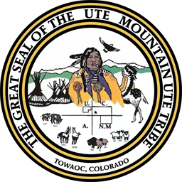

# **EcoClassify** SyncroSim Package

    <a href="https://github.com/ApexRMS/A331-watchtower">
 

## Classify land cover with ease
 

### **EcoClassify** is an open-source <a href="https://syncrosim.com/" target="_blank">SyncroSim</a> package for classifying pixels of aerial or satellite imagery.

**EcoClassify** uses image segmentation to identify features in an image at the pixel level. Originally designed for classification of snow cover from satellite imagery, **ecoClassify** has been expanded to classify other land cover features including invasive species, urban agriculture, and more.

 

## Requirements

The latest version of **ecoClassify** has the following requirements:

- SyncroSim <a href="https://syncrosim.com/studio-download/" target="_blank">version 3.0.0</a> or higher.
- rsyncrosim <a href="https://syncrosim.github.io/rsyncrosim/" target="_blank">version 2.0.0</a> or higher.

 

## Getting Started

For a guided tutorial on **ecoClassify**, including installation, set up, model run, and output visualization, see the [Getting Started](https://apexrms.github.io/A331-watchtower/getting_started.html) page.

 

## Key Links

Browse source code for **ecoClassify** at <a href="http://github.com/ApexRMS/A331-watchtower/" target="_blank">http://github.com/ApexRMS/A331-watchtower/</a>.  
Report a bug or contribute an idea at
<a href="http://github.com/ApexRMS/A331-watchtower/issues" target="_blank">http://github.com/ApexRMS/A331-watchtower/issues</a>.  

 

## Developers

Hannah Faith Adams (Author) 
 
Alex Filazzola (Author) 

 

## Contributors

The ecoClassify SyncroSim package was designed and developed by <a href="https://apexrms.com/" target="_blank">ApexRMS</a>. The development of ecoClassify has been generously supported by several groups, including:
\
Ute Mountain Ute Tribe
The U.S. Geological Survey
University of Toronto
Western University
